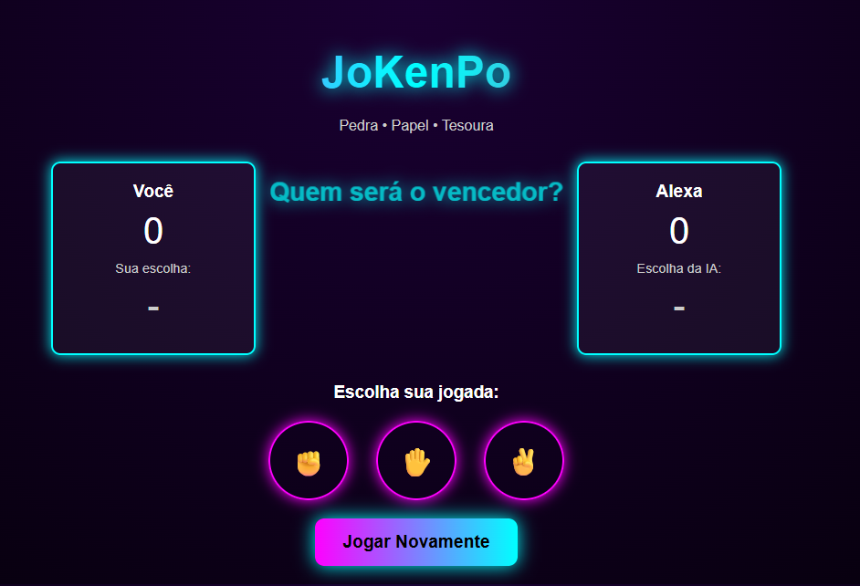

# JoKenPo

Este projeto é uma versão simples do clássico jogo de Pedra, Papel e Tesoura, criada com HTML, CSS e JavaScript.

O objetivo é permitir que o usuário escolha uma jogada e compare com a escolha da "Alexa" (computador), exibindo o resultado na tela e atualizando a pontuação.

## Estrutura do projeto

O projeto é composto por três arquivos principais:

- [index.html](index.html): contém a estrutura da interface do jogo, incluindo o placar, as opções de escolha e o botão de reiniciar.
- [style.css](style.css): responsável pela aparência visual do projeto, com cores, layout, botões e animações.
- [script.js](script.js): implementa a lógica do jogo, incluindo a comparação entre as escolhas e o controle da pontuação.

## Como funciona a lógica

1. O usuário clica em uma das opções: pedra, papel ou tesoura.
2. O JavaScript captura a escolha do jogador.
3. O computador escolhe uma opção aleatória entre as três disponíveis.
4. O código compara as duas escolhas para definir o vencedor:
   - Pedra vence de Tesoura
   - Papel vence de Pedra
   - Tesoura vence de Papel
5. O resultado é exibido na tela e a pontuação é atualizada.
6. Se houver empate, nenhuma pontuação é adicionada.
7. O botão "Jogar Novamente" reinicia o placar e limpa as escolhas exibidas.

## Fluxo do jogo

- O usuário seleciona uma jogada.
- A escolha do computador é sorteada.
- A interface mostra:
  - a escolha do jogador
  - a escolha da IA
  - o vencedor da rodada
  - os pontos atualizados

## Como executar localmente

Você pode abrir o arquivo [index.html](index.html) diretamente no navegador.

Se preferir, pode usar uma extensão como Live Server no VS Code para visualizar o projeto de forma mais prática.

## Tecnologias utilizadas

- HTML
- CSS
- JavaScript

## Explicando o JavaScript

O arquivo [script.js](script.js) é responsável por toda a lógica do jogo. Ele não usa funções nomeadas como `function nomeDaFuncao()`, mas sim trechos de código executados a partir de eventos da interface.

### 1. Seleção dos elementos da página

As primeiras linhas do script pegam os elementos HTML que serão atualizados durante o jogo:

- `choices`: todos os botões de escolha
- `playerChoiceSpan` e `computerChoiceSpan`: onde aparecem as jogadas escolhidas
- `winnerText`: texto que mostra o resultado da rodada
- `playerScoreSpan` e `computerScoreSpan`: placar do jogador e da IA

Esses elementos são selecionados com `document.querySelectorAll()` e `document.getElementById()`.

### 2. Variáveis de controle

O código cria duas variáveis para armazenar a pontuação:

- `playerScore`: pontuação do usuário
- `computerScore`: pontuação da IA

Também existe um array chamado `options`, com as opções válidas do jogo:

- `pedra`
- `papel`
- `tesoura`

### 3. Evento de clique nas opções

O código percorre todos os botões de escolha com `forEach()` e adiciona um evento de clique em cada um.

Quando o usuário clica em uma opção, o script:

1. pega a escolha do jogador
2. escolhe uma opção aleatória para o computador
3. mostra as duas escolhas na tela
4. compara as escolhas para decidir quem venceu
5. atualiza o placar e a mensagem do resultado

### 4. Lógica de comparação

A comparação é feita com condicionais `if`, `else if` e `else`.

As regras são:

- Pedra vence de Tesoura
- Papel vence de Pedra
- Tesoura vence de Papel

Se as opções forem iguais, o resultado é empate.

### 5. Botão de reiniciar

O botão "Jogar Novamente" também recebe um evento de clique. Quando acionado, o script:

- zera o placar
- limpa as escolhas exibidas
- volta a mensagem inicial para a tela

## Observação

Este projeto é ótimo para praticar conceitos básicos de:

- manipulação do DOM
- eventos em JavaScript
- lógica de condicionais
- atualização de elementos da página
